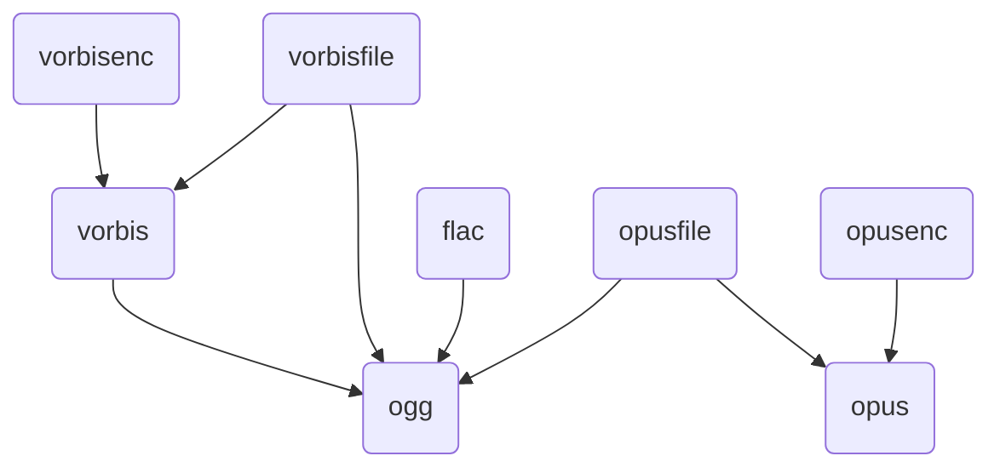

# xiph-audio-windows-build

Windows build for xiph audio libraries (ogg, vorbis, flac, opus, opusfile, opusenc)

You can download the latest build from [Actions](https://github.com/Demonese/xiph-audio-windows-build/actions/workflows/build.yml).

The artifact includes the following files:

```
├── bin
│   ├── FLAC.dll
│   ├── ogg.dll
│   ├── opus.dll
│   ├── opusenc.dll
│   ├── opusfile.dll
│   ├── vorbis.dll
│   ├── vorbisenc.dll
│   └── vorbisfile.dll
├── include
│   ├── FLAC
│   │   ├── all.h
│   │   ├── assert.h
│   │   ├── callback.h
│   │   ├── export.h
│   │   ├── format.h
│   │   ├── metadata.h
│   │   ├── ordinals.h
│   │   ├── stream_decoder.h
│   │   └── stream_encoder.h
│   ├── ogg
│   │   ├── config_types.h
│   │   ├── ogg.h
│   │   └── os_types.h
│   ├── opus
│   │   ├── opus.h
│   │   ├── opus_defines.h
│   │   ├── opus_multistream.h
│   │   ├── opus_projection.h
│   │   ├── opus_types.h
│   │   ├── opusenc.h
│   │   └── opusfile.h
│   └── vorbis
│       ├── codec.h
│       ├── vorbisenc.h
│       └── vorbisfile.h
└── lib
    ├── cmake
    │   ├── FLAC
    │   │   ├── flac-config.cmake
    │   │   ├── flac-config-version.cmake
    │   │   ├── targets.cmake
    │   │   └── targets-release.cmake
    │   ├── Ogg
    │   │   ├── OggConfig.cmake
    │   │   ├── OggConfigVersion.cmake
    │   │   ├── OggTargets.cmake
    │   │   └── OggTargets-release.cmake
    │   ├── Opus
    │   │   ├── OpusConfig.cmake
    │   │   ├── OpusConfigVersion.cmake
    │   │   ├── OpusTargets.cmake
    │   │   └── OpusTargets-release.cmake
    │   ├── opusenc
    │   │   ├── OpusEncTargets.cmake
    │   │   └── OpusEncTargets-release.cmake
    │   ├── opusfile
    │   │   ├── OpusFileConfig.cmake
    │   │   ├── OpusFileConfigVersion.cmake
    │   │   ├── OpusFileTargets.cmake
    │   │   └── OpusFileTargets-release.cmake
    │   └── Vorbis
    │       ├── VorbisConfig.cmake
    │       ├── VorbisConfigVersion.cmake
    │       ├── VorbisTargets.cmake
    │       └── VorbisTargets-release.cmake
    ├── FLAC.lib
    ├── ogg.lib
    ├── opus.lib
    ├── opusenc.lib
    ├── opusfile.lib
    ├── pkgconfig
    │   ├── flac.pc
    │   ├── ogg.pc
    │   ├── opus.pc
    │   ├── vorbis.pc
    │   ├── vorbisenc.pc
    │   └── vorbisfile.pc
    ├── vorbis.lib
    ├── vorbisenc.lib
    └── vorbisfile.lib
```

Dependency graph:




